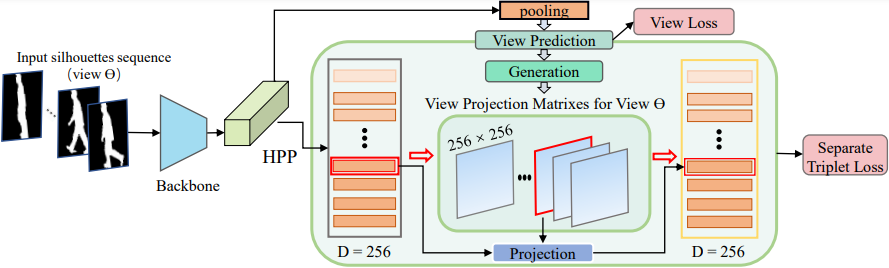

# gait-view


The codes for the paper "Silhouette-based View-embeddings for Gait Recognition Under Multiple Views".
The base code are forked from [gaitset](https://github.com/AbnerHqC/GaitSet) and [gaitGL](https://github.com/bb12346/GaitGL) 


## Main Results


## Citation
Please cite these papers in your publications if it helps your research:

``` 
@inproceedings{chai2021silh,
  author = {Tianrui Chai, Xinyu Mei, Annan Li, Yunhong Wang},
  booktitle = {ICIP},
  title = {Silhouette-based View-embeddings for Gait Recognition Under Multiple Views},
  year = {2021}
}
```
